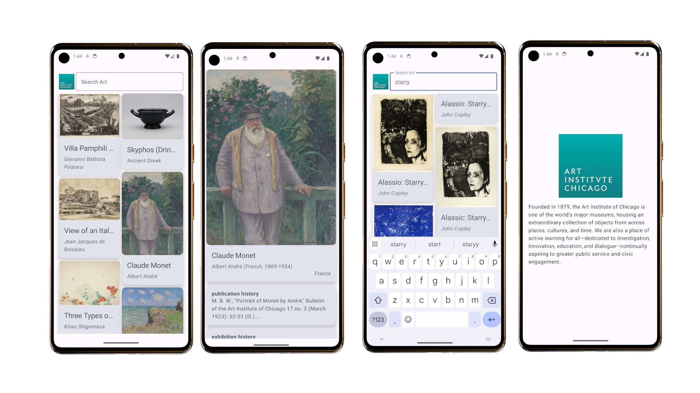

# Artic Browser

Artic Browser is an Android application that allows users to explore the [Art Institute of Chicago](https://www.artic.edu/)’s collection via their [public API](https://api.artic.edu/docs/). I developed it as part of my [Mobile Software Laboratory](https://portal.vik.bme.hu/kepzes/targyak/VIAUMB02/en/) course at [BME](https://www.bme.hu/).

## About the app

The app was developed using modern Android technologies, including [Jetpack Compose](https://developer.android.com/compose), the [Paging library](https://developer.android.com/topic/libraries/architecture/paging/v3-overview), [DaggerHilt](https://developer.android.com/training/dependency-injection/hilt-android), and more. It leverages [Room](https://developer.android.com/training/data-storage/room) along with the Paging library and a [RemoteMediator](https://developer.android.com/reference/kotlin/androidx/paging/RemoteMediator) to cache data locally. This enables the application to function even without a network connection, using previously fetched data stored in the local database.

The app also integrates several Google services, including Google Analytics to track frequently visited screens, and Crashlytics for monitoring and reporting crashes.

## License

This project is licensed under the MIT License - see the [LICENSE](LICENSE) file for details.

